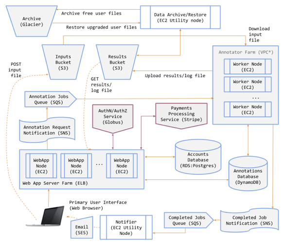
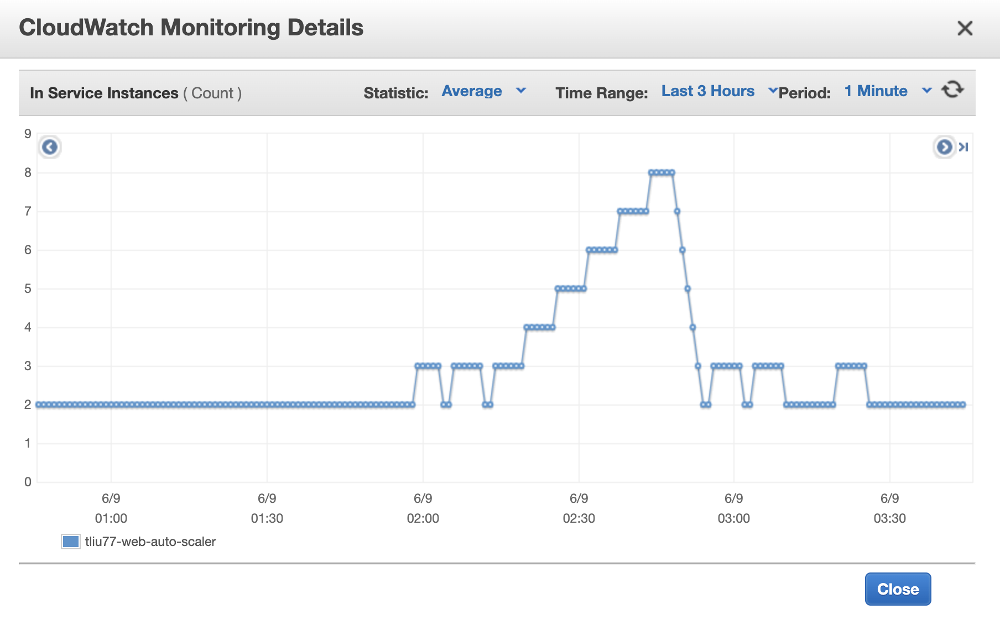
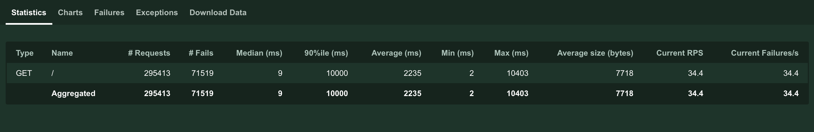
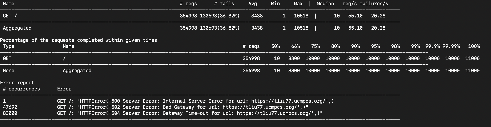
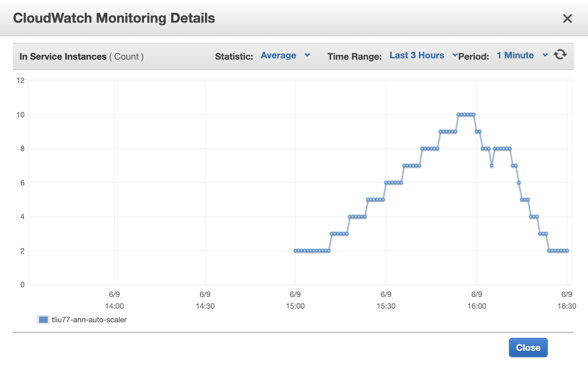

# gas-framework

## Introduction

An enhanced web framework (based on [Flask](http://flask.pocoo.org/)) for use in the capstone project. Adds robust user authentication (via [Globus Auth](https://docs.globus.org/api/auth)), modular templates, and some simple styling based on [Bootstrap](http://getbootstrap.com/).

Directory contents are as follows:

* `/web` - The GAS web app files
* `/ann` - Annotator files
* `/util` - Utility scripts for notifications, archival, and restoration
* `/aws` - AWS user data files

## Architecture

## Archive Process
1. Create a SNS and SQS called tliu77_archive.
2. Create a SQS called tliu77_archive, subscriobe to the tliu77_archive SNS topic, and set the message delivery delay to 5mins (300 seconds).
3. Send a notification to tliu77_archive SNS topic when a job has been completed.
4. Use a while loop in the archive.py to accept the message, if a message received from tliu77_archive and the user is not premium user, get the result content from s3, uploaded the result to the s3 Glacier, store the archive ID to the DynamoDB, set the "archived" attribute to True, then delete the message and the result file from s3.

## Restore Process
1. Create two SNS topic named tliu77_restore and tliu77_thaw.
2. Create two SQS named tliu77_restore and tliu77_thaw and subscribe them to the related SNS topic.
3. Send a notification to tliu77_archive SNS topic when user upgrade to the premium user.
4. If a message received from tliu77_restore, exteact the user_id from message and retrieve the ids of all archived object, initiate a retrieval request for each object, assign the SNS tliu77_thaw topic to the request then send the it to the Glacier, the tliu77_thaw will receive a notification when the restore process finished.
5. If a message received from tliu77_thaw, extract the archive id and restore id from the message, use the restore id to get the object content from Glacier, use archive id to get the original s3_result_key of the object from DynamoDB (I create a index on archive_id in the database before), and store the object to the s3 results bucket, then update the "archived" attrbute to False in the database.

# Optional Exercises
## Web Servers Load Test
### Results

  
  
  

1. Scale out: I launched the load test on Locust with 300 users @ 30/sec. The number of instances goes all the way up, there is a new instance launched every 6 minutes. 
2. Scalt in: The number of instances goes down when I terminate the load test until there are only 2 instances remaining, because the minimum number of instances is set to 2 in the auto scaling group. Sometimes, at the very end, there is a new instance launched autolatically even if I didn't send any request to the web server. To figure out what's happening, I checked the target group, I saw there is a instance failed the heath check (timeout) and another instance is launched by the auto scaling group. (I run the test at last day so the environment is very busy, I saw lots of instances failed the heath check because of the timeout error.)

## Annotator Load Test

  

1. Scale out: In the ann_load.py, it sends a notification to tliu77_job_requests every 5 second (12/min), a new instance is launched as soon as the cloud watch alarm is triggered, in the next hour, there is a new instances launched every 6 minutes, because the "wait time" in the scale out policy is 5 minutes and 1 minutes is needed to trigger the cloud watch alarm. The number of instances does not increase after reaching 10, because the maximum num of instances is set to 10.
2. Scale in: After terminating the ann_load.py, the number of instances start going down, but there is a lag sometime, because in the simple scaling group, the policy need to wait for a specific time period before starting next scaling activity (waitting for health check or a cooldown time).

# References
https://boto3.amazonaws.com/v1/documentation/api/latest/reference/services/s3.html#S3.Client.generate_presigned_post

https://boto3.amazonaws.com/v1/documentation/api/latest/reference/services/dynamodb.html

https://boto3.amazonaws.com/v1/documentation/api/latest/reference/services/dynamodb.html#DynamoDB.Client.update_item

https://boto3.amazonaws.com/v1/documentation/api/latest/guide/s3-example-download-file.html

https://docs.aws.amazon.com/amazondynamodb/latest/developerguide/GettingStarted.Python.03.html

https://boto3.amazonaws.com/v1/documentation/api/latest/reference/services/s3.html#S3.Client.upload_file

https://boto3.amazonaws.com/v1/documentation/api/latest/reference/services/sns.html#SNS.Client.publish

https://boto3.amazonaws.com/v1/documentation/api/latest/reference/services/sqs.html#SQS.Client.receive_message